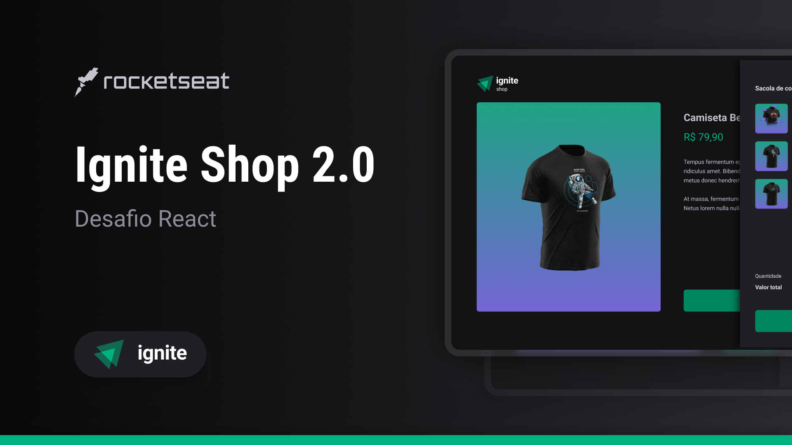

Aplicação desenvolvida como desafio da trilha Ignite da [RockeatSeat](https://rocketseat.com.br/?utm_source=aluno&utm_medium=germano-ricardi&utm_campaign=dev_fullstack).

Veja a aplicação em produção:
[https://germano-ricardi-ignite-shop.vercel.app](https://germano-ricardi-ignite-shop.vercel.app)

## Simule uma compra

Na página de checkout utilize as seguintes informações:
*   Número de cartão: **4242 4242 4242 4242**
*   Data de vencimento do cartão: Qualquer data futura no formato MM/AA, exemplo: 01/30
*   CVC: Qualquer número de 3 dígitos, exemplo: 147
*   Nos demais campos pode utilizar informações fictícias

## Descrição  

Loja virtual desenvolvida utilizando a API da Stripe, recursos disponíveis:
*   Listagem de produtos cadastrados na Stripe
*   Carrinho de compras
*   Checkout integrado com Stripe

Apesar de serem poucas as funcionalidades, foram aplicados conceitos como:
*   Axios
*   Roteamento e React Router DOM
*   Context API
*   Hooks
*   Componentes

## Tecnologias utilizadas

* [x] [NodeJS](https://nodejs.org/en)
* [x] [React](https://reactjs.org)
* [x] [Yarn](https://yarnpkg.com)
* [x] [NextJS](https://nextjs.org)
* [x] [TypeScript](https://www.typescriptlang.org)

## Quickstart
Clone o repositório:
```sh
$  git clone https://github.com/germanoricardi/rocketseat-ignite-004-ignite-shop
```

Renomeie o arquivo **.env.local.example** para **.env.local**
*   Altere a variável **NEXT_URL** para a url da sua aplicação, por exemplo: http://localhost:300
*   As variáveis **STRIPE_PUBLIC_KEY** e **STRIPE_SECRET_KEY** devem ser preenchidas com as informações fornecidas na sua conta da Stripe, pode criar uma conta como DEV que conseguirá facilmente as informações

Para executar a aplicação utilize os seguintes comandos na raiz da aplicação:
```sh
$  yarn install
$  yarn dev
```